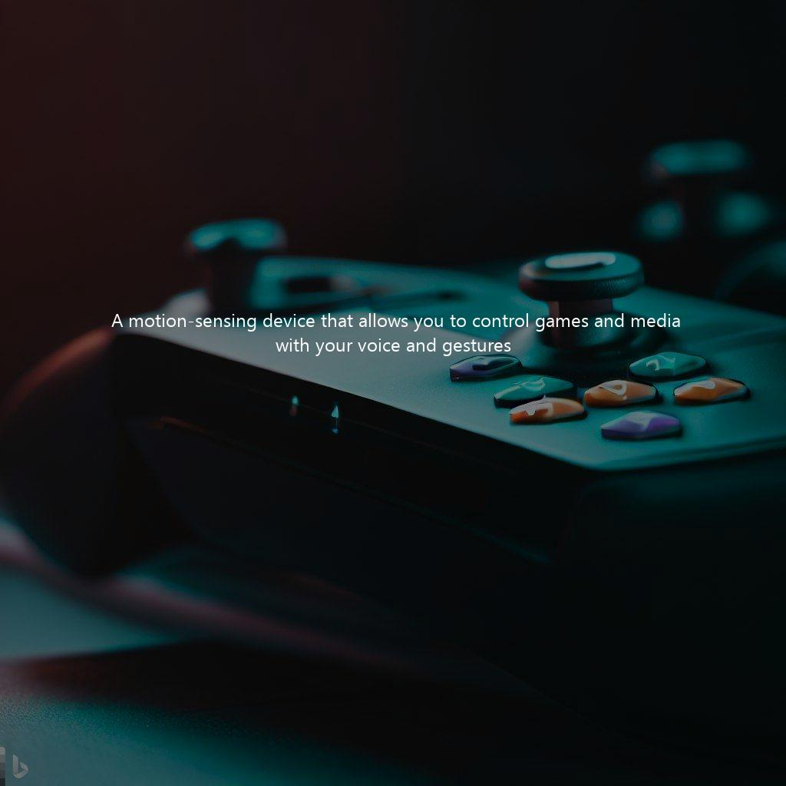
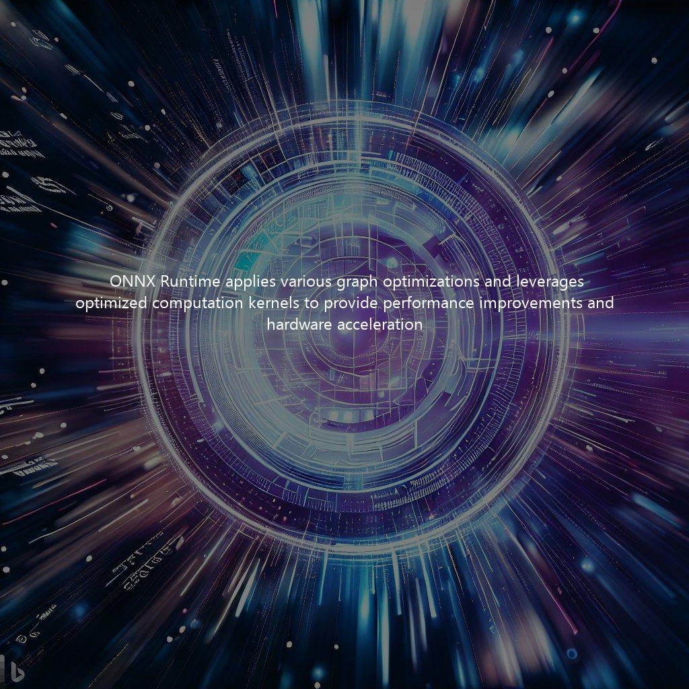
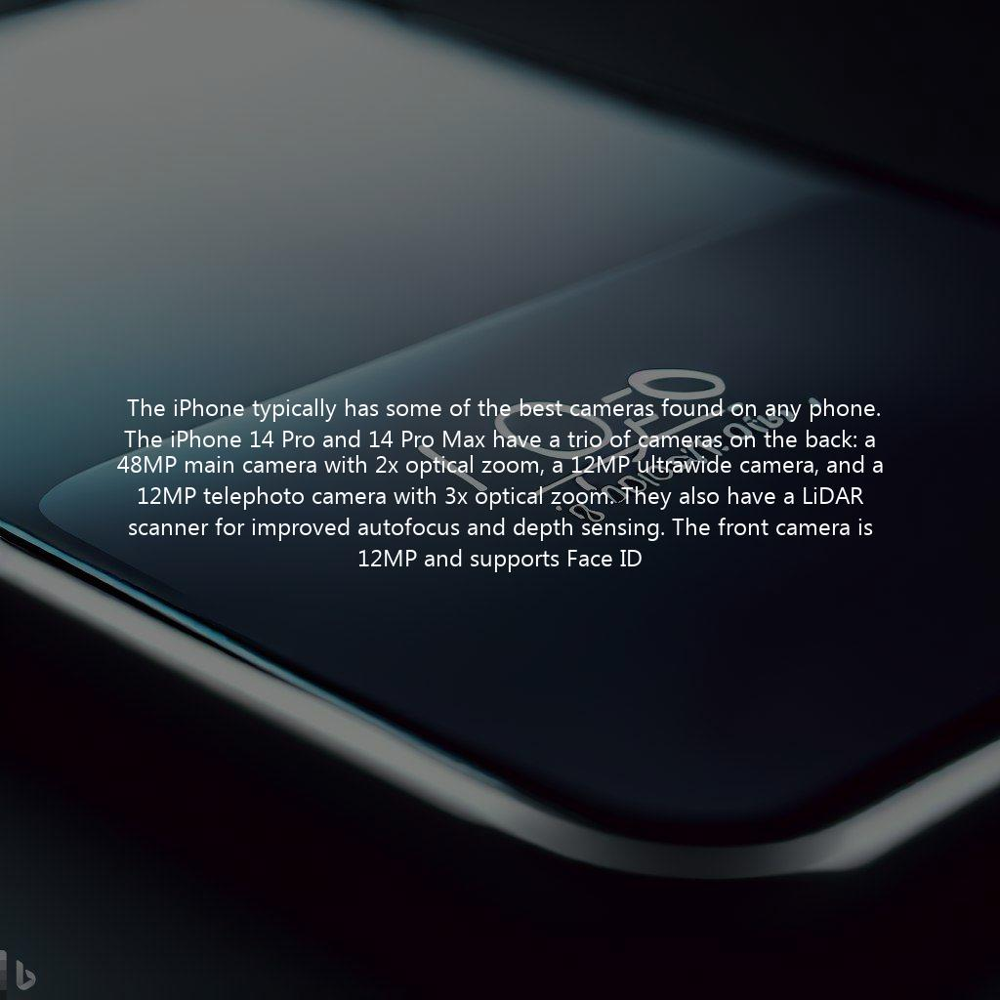

# combine.AI
Combining Microsoft's Bing Chat and Bing Image Creator capabilities to automate design creation.

  
  
  

powered by Bing Chat, Bing Image Creator, and EdgeGPT

## Usage

### Collect cookies

1. Open Microsoft Edge and ensure you are logged into your Microsoft account.
2. Open [bing.com/chat](https://bing.com/chat)
3. If you see a chat feature, you are good to continue!
4. Install the Cookie-Editor extension for [Chrome](https://chrome.google.com/webstore/detail/cookie-editor/hlkenndednhfkekhgcdicdfddnkalmdm) or [Firefox](https://addons.mozilla.org/en-US/firefox/addon/cookie-editor/)
5. Go to [bing.com](https://bing.com)
6. Open the Cookie-Editor extension
7. Click "Export" on the bottom right, then "Export as JSON" (This saves your cookies to clipboard.)
8. Paste your cookies into a file `bing_cookies_*.json`.
   - NOTE: The **cookies file name MUST follow the regex pattern `bing_cookies_*.json`**, such that it can be recognized by internal cookie processing mechanisms.

### Run `create.py`

`python create.py --cookie-file "./bing_cookies_chat.json" --prompt "product to create design for"`
